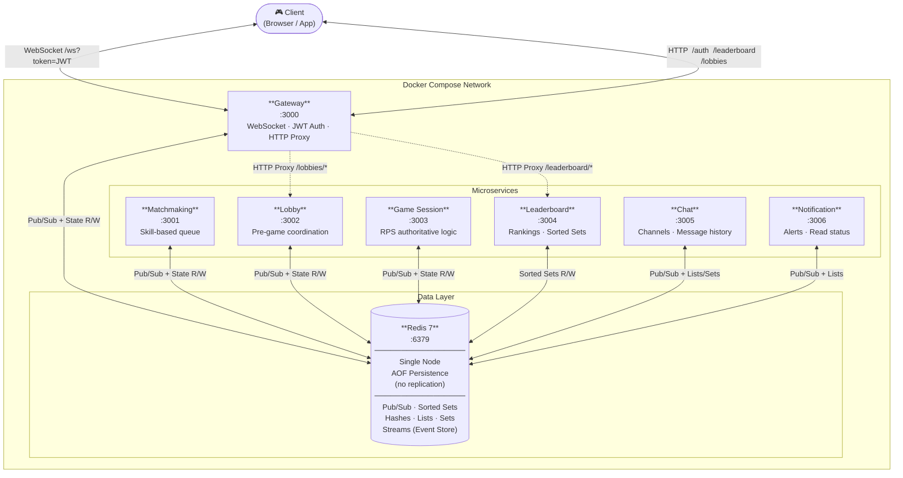
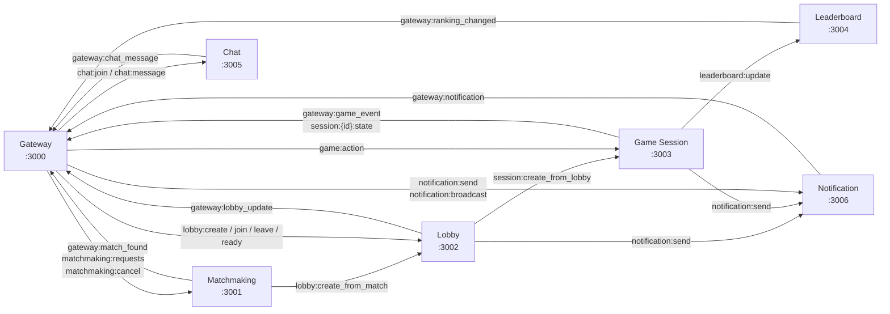

# Multiplayer Gaming Platform

A distributed real-time multiplayer gaming platform built with **Python** (FastAPI), **WebSockets**, **Redis Pub/Sub**, and **Event Sourcing**.

## System Architecture

### High-Level Overview


---

### Service-to-Service Communication (Redis Pub/Sub Channels)

All inter-service messaging is routed through Redis Pub/Sub. The diagram below shows the logical flow (each arrow represents a publish → subscribe relationship via a named Redis channel).



---

### Redis Data Layout

| Key Pattern | Structure | Owner | Description |
|---|---|---|---|
| `player:{id}:status` | String | Gateway | Player online/offline status |
| `lobby:{id}` | Hash/JSON | Lobby | Full lobby state |
| `lobby:{id}:ready:{player_id}` | String | Lobby | Per-player ready flag |
| `match:{id}` | Hash/JSON | Matchmaking | Match metadata |
| `session:{id}` | Hash/JSON | Game Session | Session metadata |
| `session:{id}:state` | Hash/JSON | Game Session | Live game state |
| `leaderboard:{category}` | Sorted Set | Leaderboard | Rankings (global / casual / ranked) |
| `player_stats:{id}:{category}` | Hash | Leaderboard | Per-player statistics |
| `chat:channel:{id}:members` | Set | Chat | Online members in channel |
| `chat:channel:{id}:messages` | List | Chat | Rolling last-100 messages |
| `notifications:{player_id}` | List | Notification | Last-100 notifications with read status |
| `events:{stream_id}` | Stream | All services | Immutable event-sourcing log |

---

### Services

| Service | Port | Responsibility |
|---------|------|----------------|
| Gateway | 3000 | WebSocket entry point, JWT auth, HTTP reverse proxy, message routing |
| Matchmaking | 3001 | Skill-based player queue (Casual / Ranked), auto-creates lobby on match |
| Lobby | 3002 | Pre-game coordination: join, leave, ready — transitions to Game Session |
| Game Session | 3003 | Authoritative Rock Paper Scissors logic, disconnect handling |
| Leaderboard | 3004 | Persistent rankings via Redis Sorted Sets (global / casual / ranked) |
| Chat | 3005 | Channel-based messaging with rolling 100-message history |
| Notification | 3006 | Async alerts with read/unread tracking, last-100 per player |
| Redis | 6379 | Pub/Sub bus · Distributed state · Event Sourcing streams |

---

## Quick Start

```bash
docker-compose up --build
```

Requires Docker & Docker Compose. All services start automatically.

## Project Structure

```
.
├── docker-compose.yml
├── requirements.txt
├── shared/                # Auth, event sourcing, Redis client, Pydantic types
└── services/
    ├── gateway/           # :3000
    ├── matchmaking/       # :3001
    ├── lobby/             # :3002
    ├── game-session/      # :3003
    ├── leaderboard/       # :3004
    ├── chat/              # :3005
    └── notification/      # :3006
```