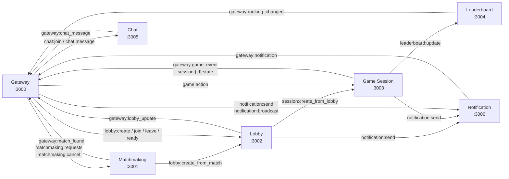

# Multiplayer Gaming Platform

A distributed real-time multiplayer gaming platform built with **Python** (FastAPI), **WebSockets**, **Redis Pub/Sub**, and **Event Sourcing**.

## System Architecture

### High-Level Overview


---

### Service-to-Service Communication (Redis Pub/Sub Channels)

All inter-service messaging is routed through Redis Pub/Sub. The diagram below shows the logical flow (each arrow represents a publish → subscribe relationship via a named Redis channel).



---

### Redis Data Layout

| Key Pattern | Structure | Owner | Description |
|---|---|---|---|
| `player:{id}:status` | String | Gateway | Player online/offline status |
| `lobby:{id}` | Hash/JSON | Lobby | Full lobby state |
| `lobby:{id}:ready:{player_id}` | String | Lobby | Per-player ready flag |
| `match:{id}` | Hash/JSON | Matchmaking | Match metadata |
| `session:{id}` | Hash/JSON | Game Session | Session metadata |
| `session:{id}:state` | Hash/JSON | Game Session | Live game state |
| `leaderboard:{category}` | Sorted Set | Leaderboard | Rankings (global / casual / ranked) |
| `player_stats:{id}:{category}` | Hash | Leaderboard | Per-player statistics |
| `chat:channel:{id}:members` | Set | Chat | Online members in channel |
| `chat:channel:{id}:messages` | List | Chat | Rolling last-100 messages |
| `notifications:{player_id}` | List | Notification | Last-100 notifications with read status |
| `events:{stream_id}` | Stream | All services | Immutable event-sourcing log |

---

### Services

| Service | Port | Responsibility |
|---------|------|----------------|
| Gateway | 3000 | WebSocket entry point, JWT auth, HTTP reverse proxy, message routing |
| Matchmaking | 3001 | Skill-based player queue (Casual / Ranked), auto-creates lobby on match |
| Lobby | 3002 | Pre-game coordination: join, leave, ready — transitions to Game Session |
| Game Session | 3003 | Authoritative Rock Paper Scissors logic, disconnect handling |
| Leaderboard | 3004 | Persistent rankings via Redis Sorted Sets (global / casual / ranked) |
| Chat | 3005 | Channel-based messaging with rolling 100-message history |
| Notification | 3006 | Async alerts with read/unread tracking, last-100 per player |
| Redis | 6379 | Pub/Sub bus · Distributed state · Event Sourcing streams |

---

## Quick Start

### Prerequisites

- Docker & Docker Compose
- Python 3.11+ (for local development)

### Run with Docker Compose

```bash
docker-compose up --build
```

### Run Locally (Development)

```bash
# Install dependencies
pip install -r requirements.txt

# Start Redis
docker run -d -p 6379:6379 redis:7-alpine

# Start each service in separate terminals
python -m services.gateway.main      # Port 3000
python -m services.matchmaking.main  # Port 3001
python -m services.lobby.main        # Port 3002
python -m services.game_session.main # Port 3003
python -m services.leaderboard.main  # Port 3004
python -m services.chat.main         # Port 3005
python -m services.notification.main # Port 3006
```

## API Usage

### Authentication

```bash
# Login
curl -X POST http://localhost:3000/auth/login \
  -H "Content-Type: application/json" \
  -d '{"username": "player1", "password": "secret"}'
```

Response:
```json
{
  "token": "eyJ0eXAiOiJKV1QiLCJhbGciOiJIUzI1NiJ9...",
  "player_id": "123e4567-e89b-12d3-a456-426614174000",
  "username": "player1"
}
```

### WebSocket Connection

```javascript
// Connect with token
const ws = new WebSocket('ws://localhost:3000/ws?token=YOUR_JWT_TOKEN');

ws.onopen = () => {
    console.log('Connected');
};

ws.onmessage = (event) => {
    const data = JSON.parse(event.data);
    console.log('Received:', data);
};

// Join matchmaking
ws.send(JSON.stringify({
    type: 'matchmaking.join',
    data: { game_mode: 'ranked', rating: 1200 }
}));

// Create lobby
ws.send(JSON.stringify({
    type: 'lobby.create',
    data: { name: 'My Lobby', game_mode: 'casual', max_players: 4 }
}));

// Send chat message
ws.send(JSON.stringify({
    type: 'chat.message',
    data: { channel_id: 'global', content: 'Hello!' }
}));

// Send game action
ws.send(JSON.stringify({
    type: 'game.action',
    data: { session_id: 'xxx', action: { type: 'move', position: {x: 10, y: 20} } }
}));
```

### HTTP Endpoints

#### Gateway Service (3000)
- `POST /auth/login` - Login and get token
- `GET /health` - Health check
- `WS /ws?token=JWT` - WebSocket connection

#### Matchmaking Service (3001)
- `GET /health` - Health check
- `GET /stats` - Queue statistics

#### Lobby Service (3002)
- `GET /health` - Health check
- `GET /lobbies` - List all lobbies
- `GET /lobbies/{lobby_id}` - Get lobby details

#### Game Session Service (3003)
- `GET /health` - Health check
- `GET /sessions` - List active sessions
- `GET /sessions/{session_id}` - Get session state
- `GET /sessions/{session_id}/leaderboard` - Session leaderboard

#### Leaderboard Service (3004)
- `GET /health` - Health check
- `GET /leaderboard/{category}` - Get leaderboard
- `GET /leaderboard/{category}/player/{player_id}` - Player stats
- `GET /leaderboard/{category}/player/{player_id}/nearby` - Nearby players

#### Chat Service (3005)
- `GET /health` - Health check
- `GET /channels/{channel_id}/messages` - Channel messages
- `GET /channels/{channel_id}/members` - Channel members

#### Notification Service (3006)
- `GET /health` - Health check
- `GET /notifications/{player_id}` - Get notifications
- `GET /notifications/{player_id}/unread-count` - Unread count
- `POST /notifications/{player_id}/mark-read` - Mark as read

## Message Types (WebSocket)

### Client to Server
- `matchmaking.join` - Join matchmaking queue
- `matchmaking.cancel` - Leave matchmaking
- `lobby.create` - Create lobby
- `lobby.join` - Join lobby
- `lobby.leave` - Leave lobby
- `lobby.ready` - Set ready status
- `game.action` - Send game action
- `chat.message` - Send chat message
- `chat.join` - Join chat channel

### Server to Client
- `connected` - Connection established
- `match.found` - Match found
- `lobby.created` - Lobby created
- `lobby.player_joined` - Player joined lobby
- `lobby.player_left` - Player left lobby
- `lobby.all_ready` - All players ready
- `session.started` - Game session started
- `game.state_update` - Game state updated
- `chat.message` - New chat message
- `notification.new` - New notification
- `ranking.changed` - Ranking changed
- `error` - Error message

## Redis Channels

### Pub/Sub Channels
- `matchmaking:requests` - Matchmaking join requests
- `matchmaking:cancel` - Matchmaking cancel requests
- `matchmaking:match_found` - Match found notifications
- `lobby:create`, `lobby:join`, `lobby:leave`, `lobby:ready` - Lobby operations
- `session:create_from_lobby` - Create session from lobby
- `game:action` - Game actions
- `chat:join`, `chat:message` - Chat operations
- `notification:send`, `notification:broadcast` - Notifications
- `gateway:*` - Gateway responses (match_found, lobby_update, game_event, etc.)
- `session:*:state` - Game state updates per session

### State Keys
- `player:{id}:status` - Player online status
- `lobby:{id}` - Lobby data
- `lobby:{id}:ready:{player_id}` - Player ready status
- `match:{id}` - Match data
- `session:{id}` - Game session data
- `session:{id}:state` - Game state (real-time)
- `leaderboard:{category}` - Leaderboard sorted set
- `player_stats:{id}:{category}` - Player stats
- `chat:channel:{id}:members` - Channel members set
- `chat:channel:{id}:messages` - Channel message list
- `notifications:{player_id}` - Player notifications
- `events:{stream_id}` - Event store streams

## Development

### Project Structure
```
.
├── docker-compose.yml          # Docker orchestration
├── requirements.txt            # Python dependencies
├── README.md                   # This file
├── shared/                     # Shared libraries
│   ├── __init__.py
│   ├── types.py               # Pydantic models
│   ├── events.py              # Event sourcing
│   ├── redis_client.py        # Redis utilities
│   └── auth.py                # JWT authentication
└── services/                   # Microservices
    ├── gateway/
    ├── matchmaking/
    ├── lobby/
    ├── game-session/
    ├── leaderboard/
    ├── chat/
    └── notification/
```

### Adding a New Event

1. Add event type to `shared/events.py`:
```python
class EventType(str, Enum):
    # ... existing events
    NEW_EVENT = "new.event"
```

2. Emit event in your service:
```python
event = Event(
    type=EventType.NEW_EVENT,
    payload={"key": "value"}
)
await event_store.append(f"stream:{id}", event)
```

## Testing

```bash
# Run all services
docker-compose up

# Test WebSocket connection
wscat -c "ws://localhost:3000/ws?token=YOUR_TOKEN"

# Or use Python client
python -c "
import asyncio
import websockets
import json

async def test():
    async with websockets.connect('ws://localhost:3000/ws?token=test') as ws:
        await ws.send(json.dumps({'type': 'matchmaking.join', 'data': {'game_mode': 'casual'}}))
        response = await ws.recv()
        print(response)

asyncio.run(test())
"
```

## Scaling

To scale services horizontally:

```yaml
# docker-compose.yml
matchmaking:
  deploy:
    replicas: 3
```

Services are stateless and use Redis for shared state, allowing multiple instances.

## License

MIT
